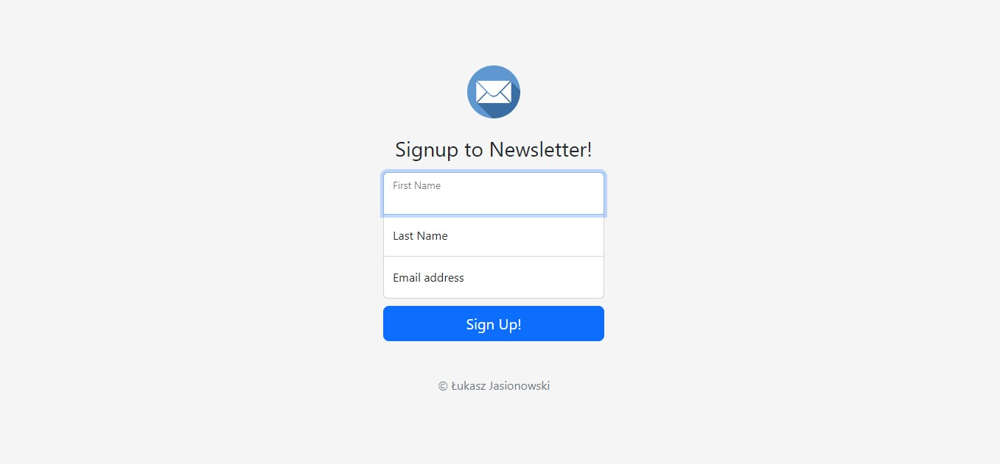
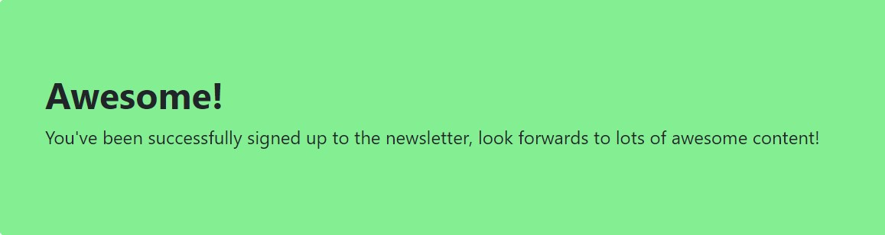
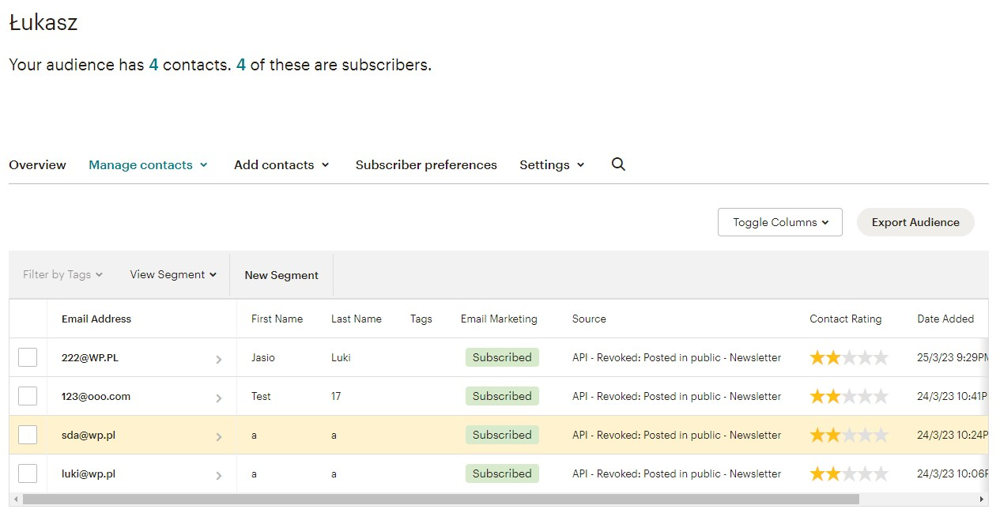
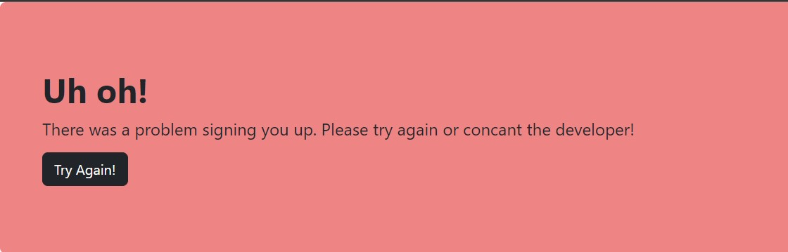

    <h1>Newsletter - Sign up</h1>

When user enter first name, last name and email address, the data is sent to mailchimp, and user receive a message.

<h4 style="color: red;">Home page ↓</h4>

<h4 style="color: red;">Success page ↓</h4>

<h4 style="color: red;">User data is stored in mailchimp ↓</h4>

In case of errors, the user receives a message with a button to try again.

<h4 style="color: red;">Failure page ↓</h4>

